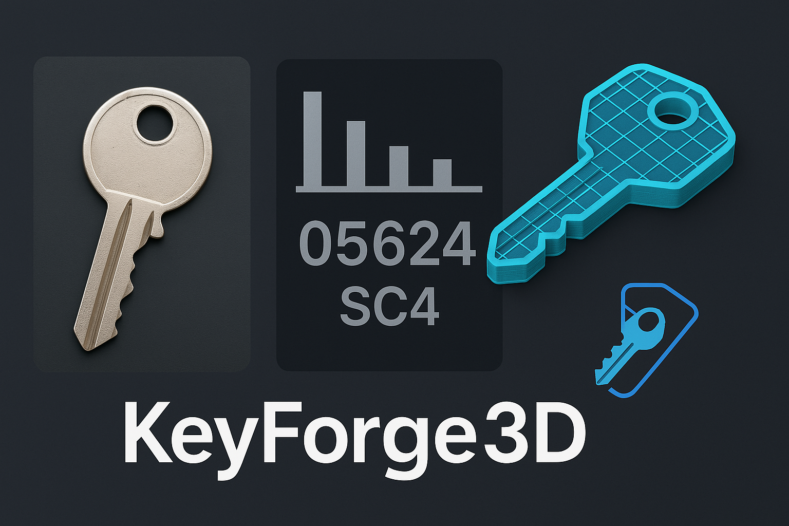

# KeyForge3D


**KeyForge3D** is an innovative application that extracts the shape of a physical key from a photo, generates a 3D model of the key, and exports it as an STL file for 3D printing. This tool is designed for locksmiths, hobbyists, or anyone needing a quick way to replicate a key using a 3D printer. The app features a user-friendly GUI built with Tkinter, making it easy to upload an image, process the key, and generate a 3D model.

## Features

- **Key Shape Extraction**: Upload a photo of a key to extract its 2D profile.
- **Bitting Analysis**: Automatically detect and analyze the key's bitting pattern (e.g., "05624").
- **3D Model Generation**: Convert the 2D key profile into a 3D model with accurate cuts and dimensions.
- **STL Export**: Export the 3D model as an STL file, ready for 3D printing.
- **User-Friendly GUI**: Simple interface to upload images and generate models with a single click.
- **Scalability**: Scale the key to real-world dimensions (default: 1 pixel = 0.1 mm; can be adjusted with a reference object).

## Demo



The app processes a photo of a key, extracts its shape, and generates a 3D model like the one shown above. The bitting code (e.g., "05624") is also displayed for reference.

## Installation

### Prerequisites

- **Python 3.8+**: Ensure Python is installed on your system.
- **pip**: Python package manager for installing dependencies.
- **3D Printer (Optional)**: To print the generated key models.

### Dependencies

KeyForge3D relies on the following Python libraries:

- `opencv-python`: For image processing and key shape extraction.
- `numpy`: For numerical operations.
- `trimesh`: For 3D model generation and STL export.
- `shapely`: For polygon operations.
- `pillow`: For image display in the GUI.

Install the dependencies using the following command:

```bash
pip install opencv-python numpy trimesh shapely pillow
```

### Clone the Repository

Clone the KeyForge3D repository to your local machine:

```bash
git clone https://github.com/makalin/KeyForge3D.git
cd KeyForge3D
```

## Usage

1. **Run the App**:
   - Run the main script to launch the GUI:

   ```bash
   python keyforge3d.py
   ```

2. **Upload a Key Photo**:
   - Click the "Upload Key Image" button and select a photo of a key.
   - The key should be placed on a plain background (e.g., white paper) with good lighting for best results.
   - Optionally, include a reference object (e.g., a coin) for accurate scaling (scaling is currently set to 1 pixel = 0.1 mm).

3. **Process the Key**:
   - Click the "Process Key and Generate 3D Model" button.
   - The app will process the image, display the bitting code, and save the 3D model as `key_model.stl`.

4. **3D Printing**:
   - Open the `key_model.stl` file in your 3D printing software (e.g., Cura, PrusaSlicer).
   - Print the key using a strong material like PLA or ABS. Use a high resolution (e.g., 0.1 mm layer height) for accurate bitting cuts.

## Code Overview

The main script (`keyforge3d.py`) includes:

- **GUI**: Built with Tkinter for user interaction.
- **Image Processing**: Uses OpenCV to detect the key's outline and analyze its bitting pattern.
- **3D Model Generation**: Uses Trimesh to create a 3D model and export it as an STL file.
- **Error Handling**: Includes basic error handling for invalid images or processing failures.

## Roadmap

- [ ] Add a 3D model preview within the app.
- [ ] Support for scaling using a reference object (e.g., a coin).
- [ ] Add key type identification (e.g., Schlage SC4, Kwikset KW1).
- [ ] Improve bitting analysis accuracy with machine learning.
- [ ] Create a mobile app version with camera integration.
- [ ] Add support for more key profiles and bitting standards.

## Contributing

Contributions are welcome! To contribute:

1. Fork the repository.
2. Create a new branch (`git checkout -b feature/your-feature`).
3. Make your changes and commit them (`git commit -m "Add your feature"`).
4. Push to your branch (`git push origin feature/your-feature`).
5. Open a pull request.

Please ensure your code follows the project's coding style and includes appropriate tests.

## License

This project is licensed under the MIT License. See the [LICENSE](LICENSE) file for details.

## Acknowledgments

- Inspired by locksmith tools for key bitting analysis.
- Built with the help of open-source libraries like OpenCV, Trimesh, and Tkinter.

## Contact

For questions, suggestions, or feedback, feel free to open an issue or reach out.
