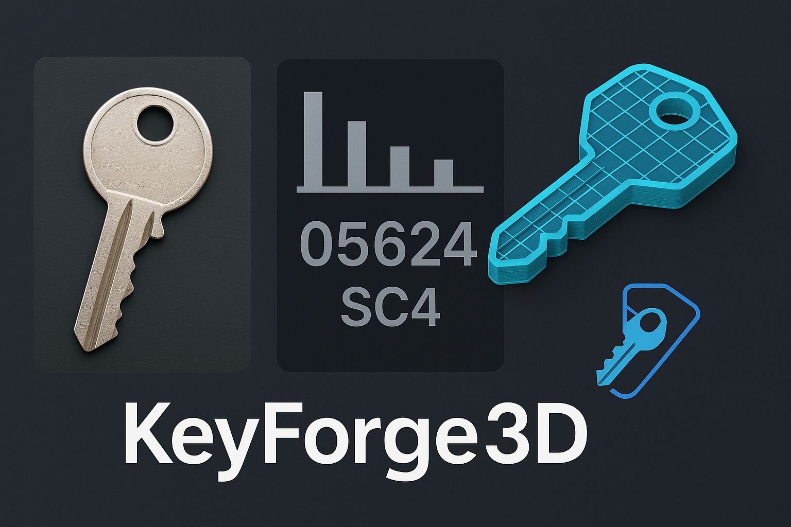

# KeyForge3D


**KeyForge3D**, fiziksel bir anahtarın fotoğrafından şeklini çıkaran, anahtarın 3D modelini oluşturan ve bunu 3D yazdırma için STL dosyası olarak dışa aktaran yenilikçi bir uygulamadır. Bu araç, çilingirler, hobi meraklıları veya bir anahtarı 3D yazıcıyla hızlıca çoğaltması gereken herkes için tasarlanmıştır. Uygulama, Tkinter ile oluşturulmuş kullanıcı dostu bir arayüz sunar; böylece bir görüntü yüklemek, anahtarı işlemek ve 3D model üretmek oldukça kolaydır.

## Özellikler

- **Anahtar Şekli Çıkartma**: Bir anahtarın 2D profilini çıkarmak için bir fotoğraf yükleyin.  
- **Bitting Analizi**: Anahtarın diş (bitting) desenini otomatik olarak tespit ve analiz eder (örneğin, "05624").  
- **3D Model Oluşturma**: 2D profil, doğru kesimler ve boyutlarla 3D modele dönüştürülür.  
- **STL Dışa Aktarımı**: 3D model, STL dosyası olarak dışa aktarılır ve yazdırılmaya hazırdır.  
- **Kullanıcı Dostu Arayüz**: Tek tıklamayla görsel yükleyip model üretmek için basit bir GUI.  
- **Ölçekleme Desteği**: Anahtar gerçeğe uygun ölçekte oluşturulur (varsayılan: 1 piksel = 0.1 mm; referans nesnesiyle ayarlanabilir).

## Demo



Uygulama bir anahtarın fotoğrafını işler, şeklini çıkartır ve yukarıda gösterildiği gibi bir 3D model üretir. Ayrıca bitting kodunu (örnek: "05624") da gösterir.

## Kurulum

### Gereksinimler

- **Python 3.8+**  
- **pip** – Bağımlılıkları yüklemek için  
- **3D Yazıcı (İsteğe Bağlı)** – Üretilen anahtarları fiziksel olarak yazdırmak için

### Bağımlılıklar

Gerekli Python kütüphaneleri:

- `opencv-python` – Görüntü işleme ve şekil çıkarma  
- `numpy` – Sayısal işlemler  
- `trimesh` – 3D model üretimi ve STL dışa aktarımı  
- `shapely` – Çokgen işlemleri  
- `pillow` – GUI içinde görüntü gösterimi

Kurulum komutu:

```bash
pip install opencv-python numpy trimesh shapely pillow
```

### Depoyu Klonlayın

```bash
git clone https://github.com/makalin/KeyForge3D.git
cd KeyForge3D
```

## Kullanım

1. **Uygulamayı Başlatın**:

```bash
python keyforge3d.py
```

2. **Bir Anahtar Fotoğrafı Yükleyin**:

- "Anahtar Görseli Yükle" düğmesine tıklayın ve bir anahtar fotoğrafı seçin.  
- En iyi sonuçlar için düz bir arka planda (örneğin beyaz kağıt) ve iyi aydınlatılmış bir görüntü kullanın.  
- İsteğe bağlı olarak, ölçekleme için referans nesnesi (örneğin bir madeni para) ekleyebilirsiniz. (Varsayılan: 1 piksel = 0.1 mm)

3. **Anahtarı İşleyin**:

- "Anahtarı İşle ve 3D Model Üret" düğmesine tıklayın.  
- Uygulama görüntüyü işler, bitting kodunu gösterir ve modeli `key_model.stl` olarak kaydeder.

4. **3D Yazdırma**:

- STL dosyasını Cura veya PrusaSlicer gibi bir yazıcı yazılımında açın.  
- PLA veya ABS gibi dayanıklı bir filament kullanın.  
- Kesimlerin doğruluğu için yüksek çözünürlük (örneğin 0.1 mm katman yüksekliği) önerilir.

## Kod Genel Bakışı

Ana betik (`keyforge3d.py`) şunları içerir:

- **GUI** – Tkinter ile yapılmıştır.  
- **Görüntü İşleme** – OpenCV ile kontur ve bitting tespiti yapılır.  
- **3D Modelleme** – Trimesh ile STL dosyası oluşturulur.  
- **Hata Yönetimi** – Geçersiz görüntü veya işlem hataları için temel hata kontrolü içerir.

## Yol Haritası

- [ ] Uygulamada 3D model önizlemesi  
- [ ] Referans nesnesiyle ölçeklendirme desteği  
- [ ] Anahtar tipi tanıma (örn: Schlage SC4, Kwikset KW1)  
- [ ] Makine öğrenimi ile bitting doğruluğunu artırma  
- [ ] Kameralı mobil uygulama sürümü  
- [ ] Daha fazla anahtar profili ve bitting standardı desteği

## Katkıda Bulunma

Katkılarınız gerçekten önemli. Her türlü öneri ve yorumunuzu iletin.
Katkıda bulunmak için:

1. Repoyu çatallayın  
2. Yeni bir dal oluşturun:  
   ```bash
   git checkout -b ozellik/senin-ozelligin
   ```  
3. Değişiklikleri yapın ve commit’leyin:  
   ```bash
   git commit -m "Özellik eklendi"
   ```  
4. Dalı gönderin:  
   ```bash
   git push origin ozellik/senin-ozelligin
   ```  
5. Pull Request açın ✅

Lütfen kod stiline ve test kapsamına dikkat edin.

## Lisans

Bu proje [MIT Lisansı](LICENSE) ile lisanslanmıştır.

## Teşekkürler

- Anahtar bitting analizine ilham olan çilingir araçlarına  
- OpenCV, Trimesh ve Tkinter gibi açık kaynak kütüphanelere

## İletişim

Sorular, öneriler veya geri bildirimler için lütfen bir "issue" açın veya iletişime geçin.
